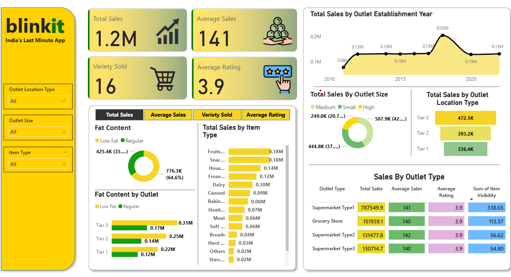

# # Blinkit Grocery Data Analysis 🛒📊

This project presents an end-to-end analysis of Blinkit grocery sales data using **Python, SQL, Power BI, and Excel**. The goal was to derive actionable insights related to product performance, customer preferences, outlet characteristics, and overall business trends.

---

## 📌 Objective

To analyze Blinkit's grocery dataset and:

- Understand sales patterns across different product categories
- Assess the performance of outlets by size, type, and location
- Discover correlations between fat content, ratings, and sales
- Build dashboards and KPIs for business decision-making

---

## 📁 Files Included

| File | Description |
|------|-------------|
| `blinkit_project.ipynb` | Python notebook for EDA and visualization |
| `blinkit_sql.sql` | SQL queries for cleaning, KPIs, and granular insights |
| `BlinkIT Grocery Data.csv` | Raw dataset used for analysis |
| `Blinkit_dashboard.xlsx` | Excel-based KPI dashboard |
| `blinkit_dashboard.pbix` | Power BI dashboard with interactive visuals |
| `README.md` | Project documentation (this file) |

---

## 🧰 Tools & Technologies

- **Python** (Pandas, Seaborn, Matplotlib)
- **MySQL** (for data cleaning, aggregation, and KPIs)
- **Power BI** (for interactive dashboards)
- **Excel** (for KPI reporting)
- **Jupyter Notebook**

---

## 🔍 Analysis Performed

### ➤ Data Cleaning & Transformation
- Standardized categorical fields like `Item Fat Content`
- Removed anomalies and inconsistent labels

### ➤ KPI Metrics via SQL
- ✅ Total Sales
- ✅ Average Sales
- ✅ Average Rating
- ✅ Total Items Sold
- ✅ Sales % by Outlet Size and Fat Content

### ➤ Exploratory Data Analysis (Python)
- Identified top-performing outlets and product types
- Visualized sales distribution, category performance, and outlet types

### ➤ Dashboards
- Power BI dashboard showing KPIs and detailed breakdowns
- Excel dashboard with pivot tables and charts
- 

---

## 📈 Key Insights

- **Regular fat items** contributed the highest to total sales
- **Medium and high-size outlets** generated most revenue
- Certain outlets consistently outperform others in both quantity and revenue
- Ratings showed a mild positive correlation with sales

---

## 🏁 Conclusion

This project demonstrates how data analysis and visualization can support business decisions in the retail domain. It highlights skills in cleaning, analyzing, and communicating insights using tools common in business analyst roles.

---

